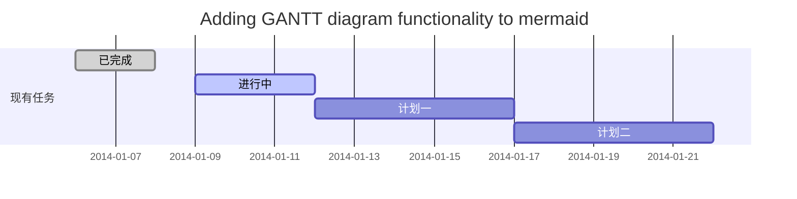
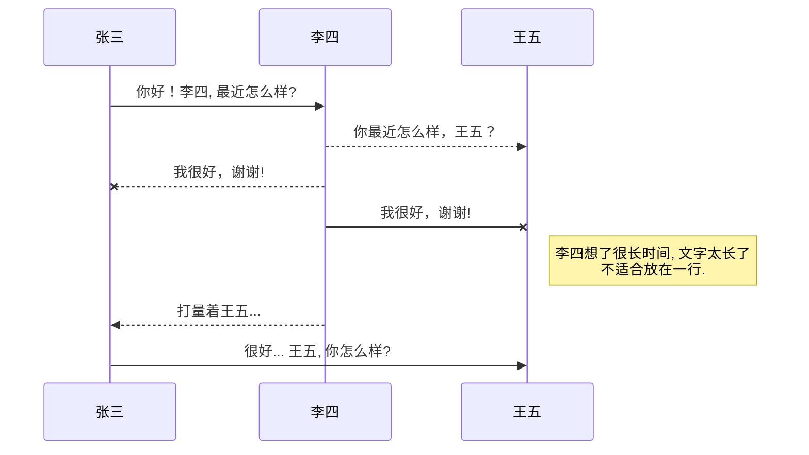
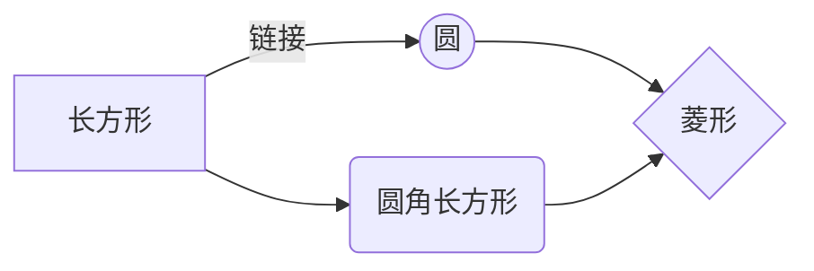

# FPGA_tango
Get familiar with the tool in a tango way.

# 联系

你好！ 这是我在阅读 *FPGA Prototyping by Verilog Examples* 一书时所作的笔记，主要内容是使用Verilog编程的结构层次和顺序流程，即分散知识点间的联系。

## 层次

按照复杂度由低到高，封装程度由高到低，可将硬件电路的设计分为以下层次：

 1. **System Level** ，系统级；
 2. **Algorithm Level** ，算法级；
 3. **Register Transfer Level** ，寄存器间数据流；
 4. **Gate Level** ，门级；
 5. **Switch Level** ，开关级；

Final goal: To get system requirements, time-demanding algorithms broken down into pieces of combinations of simple logic outputs derived from the input data, and design the order of the whole processing process, so as to make the most use of hardware resources.

可以借鉴的编程思路：编程（寄存器间数据流层级）与数字逻辑门电路设计（门级）之间其实具有一定的对称性，因此可以从效率的角度对二者进行统一评价，而不必拘泥于人为规定的编程层次。

## Building Blocks --- Modules
1. Basic inner structure
   >IO PORT
   >INTERNAL CONNECTING SIGNALS
   >BODY
2. 常驻嘉宾 --- 函数 运算符 结构标识 数据（网络）标识
	>Continuous assignment
	>Identifier	会了数外能铲钱，赃物赃款不能露，要眼尖
	>White space
	>Comment
	>Four value system


### Data Type Groups 
```verilog
module WO(A, B, C, D, WireOr);
 	input A, B, C, D;
	output WireOr;
	wor WireOr;
	assign WireOr = A ^ B;
	assign WireOr = C & D;
endmodule
```

```verilog
module WA(A, B, C, D, WireAnd);
	input A, B, C, D;
	output WireAnd;
	wand WireAnd;
	assign WireAnd = A ^ B;
	assign WireAnd = C & D;
endmodule
```

## 如何改变文本的样式

*强调文本* _强调文本_

**加粗文本** __加粗文本__

==标记文本==

~~删除文本~~

> 引用文本

H~2~O is是液体。

2^10^ 运算结果是 1024.


## 插入链接与图片

链接: [link](https://mp.csdn.net).

图片: 

带尺寸的图片: 

居中的图片: 

居中并且带尺寸的图片: 

当然，我们为了让用户更加便捷，我们增加了图片拖拽功能。


## 如何插入一段漂亮的代码片

去[博客设置](https://mp.csdn.net/configure)页面，选择一款你喜欢的代码片高亮样式，下面展示同样高亮的 `代码片`.
```javascript
// An highlighted block
var foo = 'bar';
```


## 生成一个适合你的列表

- 项目
  - 项目
    - 项目

1. 项目1
2. 项目2
3. 项目3

- [ ] 计划任务
- [x] 完成任务


## 创建一个表格
一个简单的表格是这么创建的：
项目     | Value
-------- | -----
电脑  | $1600
手机  | $12
导管  | $1

### 设定内容居中、居左、居右
使用`:---------:`居中
使用`:----------`居左
使用`----------:`居右
| 第一列       | 第二列         | 第三列        |
|:-----------:| -------------:|:-------------|
| 第一列文本居中 | 第二列文本居右  | 第三列文本居左 | 


### SmartyPants
SmartyPants将ASCII标点字符转换为“智能”印刷标点HTML实体。例如：
|    TYPE   |ASCII                          |HTML                         
|----------------|-------------------------------|-----------------------------|
|Single backticks|`'Isn't this fun?'`            |'Isn't this fun?'            |
|Quotes          |`"Isn't this fun?"`            |"Isn't this fun?"            |
|Dashes          |`-- is en-dash, --- is em-dash`|-- is en-dash, --- is em-dash|


## 创建一个自定义列表
Markdown
:  Text-to-HTML conversion tool

Authors
:  John
:  Luke


## 如何创建一个注脚

一个具有注脚的文本。[^2]

[^2]: 注脚的解释


##  注释也是必不可少的

Markdown将文本转换为 HTML。

*[HTML]:   超文本标记语言


## KaTeX数学公式

您可以使用渲染LaTeX数学表达式 [KaTeX](https://khan.github.io/KaTeX/):

Gamma公式展示 $\Gamma(n) = (n-1)!\quad\forall
n\in\mathbb N$ 是通过欧拉积分

$$
\Gamma(z) = \int_0^\infty t^{z-1}e^{-t}dt\,.
$$

> 你可以找到更多关于的信息 **LaTeX** 数学表达式[here][1].


## 新的甘特图功能，丰富你的文章


- 关于 **甘特图** 语法，参考 [这儿][2],

## UML 图表

可以使用UML图表进行渲染。 [Mermaid](https://mermaidjs.github.io/). 例如下面产生的一个序列图：:



这将产生一个流程图。:



- 关于 **Mermaid** 语法，参考 [这儿][3],

## FLowchart流程图

我们依旧会支持flowchart的流程图：
```mermaid
flowchat
st=>start: 开始
e=>end: 结束
op=>operation: 我的操作
cond=>condition: 确认？

st->op->cond
cond(yes)->e
cond(no)->op
```

- 关于 **Flowchart流程图** 语法，参考 [这儿][4].


## 导出与导入

###  导出
如果你想尝试使用此编辑器, 你可以在此篇文章任意编辑。当你完成了一篇文章的写作, 在上方工具栏找到 **文章导出** ，生成一个.md文件或者.html文件进行本地保存。

### 导入
如果你想加载一篇你写过的.md文件或者.html文件，在上方工具栏可以选择导入功能进行对应扩展名的文件导入，
继续你的创作。

 [1]: http://meta.math.stackexchange.com/questions/5020/mathjax-basic-tutorial-and-quick-reference
 [2]: https://mermaidjs.github.io/
 [3]: https://mermaidjs.github.io/
 [4]: http://adrai.github.io/flowchart.js/
